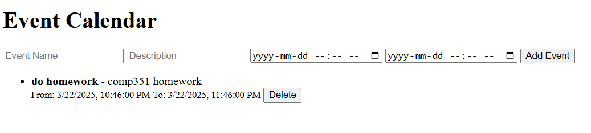

# Calendar Project 

## Part 2 additions and features
- added two api end points, get weather and get upcoming events. These are implemented in the front end as well. The weather is displayed on the current day, letting the user know what the weather will be for the current events. Then the upcoming events provides a notification in the browser for events. It does this by reminding them of any events that occur on load and checks every 10 minutes in the background. These enchance the user's experience by adding more functionality to the calendar application in a non-intrusive fashion.
- added better display of the calendar application, showing a week view, where each event is listed. The add event is now a button in the bottom right, which pops up as a card so the calendar is easily viewable. 
- added client.html to test the functionality of the api's. This can be navigates to with http://localhost:8000/client

## Images of Part 2 additions

## Setup and Installation and Usage:
- can be run and setup with "docker-compose up" using docker-compse.yml
- or can be run with:
- pip install -r requirements.txt
- uvicorn calendarProject:app --host 0.0.0.0 --port 8000 --reload
- http://127.0.0.1:8000/

## Project Description
The concept of this project will be to create a calendar application. It will have the basic features such as adding, editing, and creating events, a login and sign in page. In future iteration it will be able to handle notifications about events, and creating a gridlike view for a more appropriate calendar view.

## Current Features
- Secure login with hashed passwords and JWT tokens
- Event Management for unique users
- Role based access where admins can see all events
- Search and Pagination where users can search for events
- Database with SQLite
- Templates with Jinja2
- Weather feature for current day
- Adding events with card pop up and week view on the calendar

## Database schema design ER diagram
User
| column          | type | constraints   |
|-----------------|------|---------------|
| id              | int  | primary key   |
| username        | str  | unique        |
| hashed_password | str  | cant be empty |
| role            | str  | default user  |

Events
| column      | type     | constraints   |
|-------------|----------|---------------|
| id          | int      | primary key   |
| name        | str      | cant be empty |
| description | str      | optional      |
| start_date  | DateTime | cant be empty |
| end_date    | DateTime | cant be empty |
| user_id     | int      | foreign key   |

one(user):many(events) relationship

## API endpoints structure

### Features

GET /upcoming-events/, gets upcoming events for current user 

GET /weather, fetches current weather for Vancouver

### Authentication
POST /token, authenticates user and provides an access token

POST /register, registers new user

GET /users/me/, retrieves current user

### Events CRUD

POST /events/, creates a new event

GET /events/, gets a list of events

GET /events/{event_id}, gets one event

PUT /events/{event_id}, updates event

DELETE /events/{event_id}, deletes event

### HTML 
GET /client, displays the client page

GET /auth, displays the login page

GET /, displays the calendar

### Database Schema Design Decisions
one:many relationship where a user can have multiple events, with a foreign key (user_id) in the events table to ensure unqiue events for each user

Role Based Access: The role attribute allows for admin privlages to update and edit any users events

## Screenshots of UI

## References
- https://fastapi.tiangolo.com/tutorial/security/oauth2-jwt/#recap
- https://fastapi.tiangolo.com/tutorial/sql-databases/#run-the-app
- https://fastapi.tiangolo.com/tutorial/header-params/#import-header
- https://fastapi.tiangolo.com/tutorial/path-params-numeric-validations
- https://alpinejs.dev/start-here

